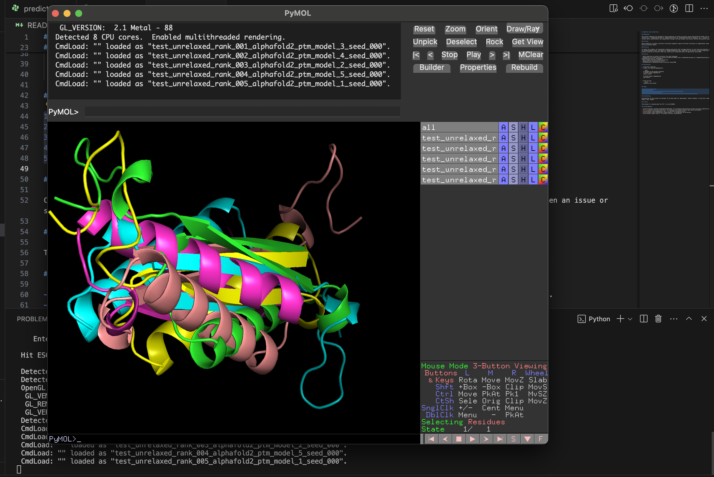

# Alphafold local predictions

## Background

This project addresses the challenge of batch prediction of protein structures using state-of-the-art models such as AlphaFold and its variants (e.g., AlphaFold2-multimer-v1, AlphaFold2-multimer-v2, AlphaFold2-multimer-v3, DeepFold, etc.). Protein structure prediction is a crucial task in bioinformatics and computational biology, offering insights into protein function and potential drug interactions.

### Problem

Batch prediction of protein structures from protein sequences requires efficient utilization of computational resources and integration of various prediction models.

### Solution

To tackle this problem, we've developed a desktop application that leverages Electron for the front-end interface, Django as a local server for handling backend logic, and Celery for managing background jobs, specifically the protein structure prediction tasks. The predicted protein structures are stored as PDB files, which can be visualized within the application using PyMOL.

## Features

- Batch prediction of protein structures from input sequences.
- Integration of multiple protein structure prediction models such as AlphaFold2-multimer-v1, AlphaFold2-multimer-v2, AlphaFold2-multimer-v3, and DeepFold.
- User-friendly interface powered by Electron.
- Background job processing with Celery.
- Visualization of predicted protein structures using PyMOL.

## Images



<!--  -->

## Installation

1. Clone this repository.
2. Install the required dependencies:

   ```bash
   # Navigate to the project directory
   # Install Python dependencies
   poetry install

   # Install Node.js dependencies
   npm install
   ```

3. Start the app:
   ```bash
   localfold start-client
   ```

## Usage

1. Open the Electron app.
2. Setup the model.
3. Upload a file containing protein sequences for structure prediction.
4. Initiate the prediction process.
5. Once completed, visualize the predicted protein structures using the integrated PyMOL viewer.

## Contributing

Contributions to this project are welcome! If you have ideas for improvements, feature requests, or bug fixes, please open an issue or submit a pull request.

## License

This project is licensed under the [MIT License](LICENSE).

## Acknowledgments

- [AlphaFold](https://github.com/deepmind/alphafold): for providing state-of-the-art protein structure prediction models.
- [Electron](https://www.electronjs.org/): for enabling cross-platform desktop application development.
- [Django](https://www.djangoproject.com/): for building the backend server.
- [Celery](https://docs.celeryproject.org/en/stable/): for background job processing.
- [PyMOL](https://pymol.org/2/): for protein structure visualization.
